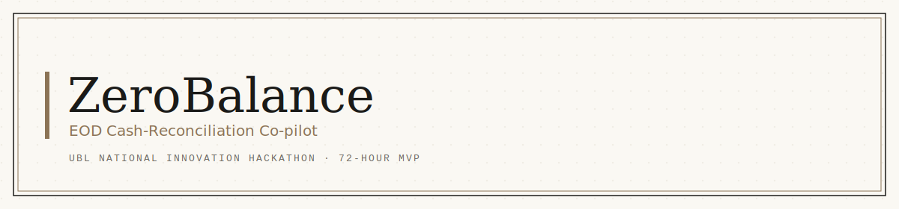
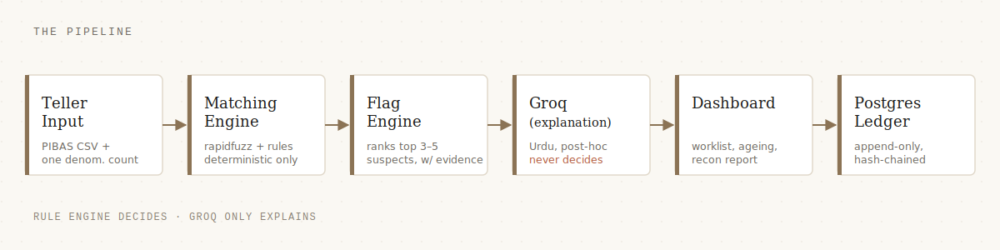

<p align="center">
  
</p>

# ZeroBalance v2 — Back-office Validation & Reconciliation Layer

> **CBS posts what the teller types. ZeroBalance makes sure the teller typed the truth.**

Overlay on top of the bank's core banking system (PIBAS / T24 / Symbols). On-prem. Not a replacement — a sidecar that catches errors before they hit CBS, reconciles physical cash against CBS records at EOD, and replaces corruption-prone paper artifacts (the Excess Ledger) with a signed, hash-chained digital audit trail.

Two audit cadences from **one artifact set**: daily EOD certification + half-yearly closing (same tables, different query window).

Built for the UBL National Innovation Hackathon (Fintech Track).

## Feature set (locked)

| # | Feature | Overlay posture | Build scope |
|---|---|---|---|
| 1 | Digital Excess Ledger + dual sign-off + audit hash | Sidecar | **Full — flagship** |
| 2 | EOD recon (opening float → engine → ranked culprits → signed PDF) | Monitor (reads PIBAS CSV) | Full |
| 3 | Cheque capture (MICR + denomination-out breakdown) | Sidecar | Full |
| 4 | Pre-post real-time validation (5 checks) | Intercept | Demo-only surface |

Pre-post is the only feature that sits in front of CBS — that's why it stays a marketing surface, not a wired production intercept.

## Architecture

Flow: `Teller Input → [Pre-post demo checks] → Matching Engine → Flag Engine → Groq (Urdu explanation) → Dashboard → PostgreSQL audit ledger`

Sidecar artifacts (parallel to CBS, not in its write path): **Digital Excess Ledger** and **cheque capture** — separately hashed and signed.

- **Deterministic engine.** Rule-based variance-signature detection: digit transposition, duplicate posting, missed reversal, denomination shortfall, cash-in/out miskey, wrong adjacent account. Every ranking reproducible and rule-explainable. No learned ranking anywhere.
- **Groq explains, never decides.** Post-hoc Urdu narration of already-ranked suspects. Never scores, filters, or re-ranks.
- **Append-only ledgers.** Audit ledger *and* Excess Ledger. Dual sign-off = two INSERT rows, not an UPDATE.
- **On-prem.** No cloud services beyond the Groq API call. No customer data in external logs.

<p align="center">
  
</p>

## Version history

- **v2 (Jul 2026)** — Fork from v1. Added Digital Excess Ledger (flagship), cheque capture, pre-post demo surface. Cut Rahbar/Qdrant RAG (no user-need evidence) and the ageing view (BOM-tier scope). See `phases/v2_plan.md`.
- **v1** — EOD reconciliation co-pilot only. Frozen at `D:\ZeroBalance`.

v1 delivery log: `phases/phase_1.md` → `phases/phase_8.md`.

## Project structure

```
backend/            FastAPI (Python 3.12)
  app/
    engine/         deterministic matching engine + anomaly (display-only)
    api.py          REST routes under /api/v1
    service.py      PIBAS CSV parsing + recon orchestration
    explain.py      Groq Urdu explanations (post-hoc)
    report.py       Recon Report PDF (WeasyPrint)
    db.py           hash-chained append-only audit ledger
  schema.sql        Postgres DDL (append-only enforced by trigger)
  tests/            pytest suite (oracle-backed)
frontend/           React 18 + Vite + TanStack Query dashboard
data/               synthetic PIBAS generator + ground_truth.py oracle
docs/               PIBAS CSV format spec
phases/             v1 delivery log + v2 plan and per-phase files
docker-compose.yml  Postgres 16 + backend + frontend
```

## Run it

Prerequisites: Docker Desktop, a free [Groq API key](https://console.groq.com).

```bash
cp .env.example .env        # then set GROQ_API_KEY
docker compose up -d --build
```

- Dashboard: http://localhost:5173
- API docs: http://localhost:8000/docs

Seed demo data (one flagged session per variance signature):

```bash
python data/generator.py --out data/sample
```

Tests (in-container; truncates the dev DB):

```bash
docker compose exec backend pytest -q
python data/ground_truth.py                    # oracle self-check
```

The engine decides. Groq just explains. That split is the whole point.

— Arham
